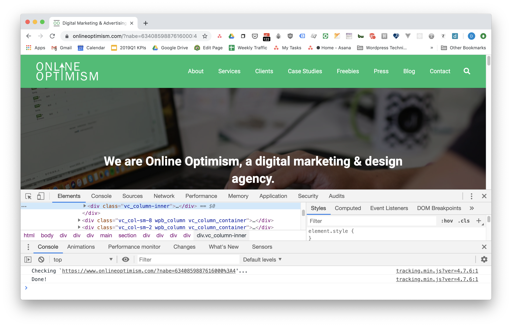
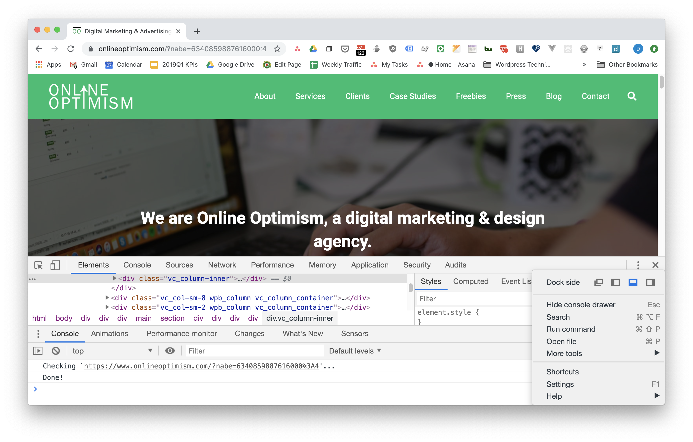
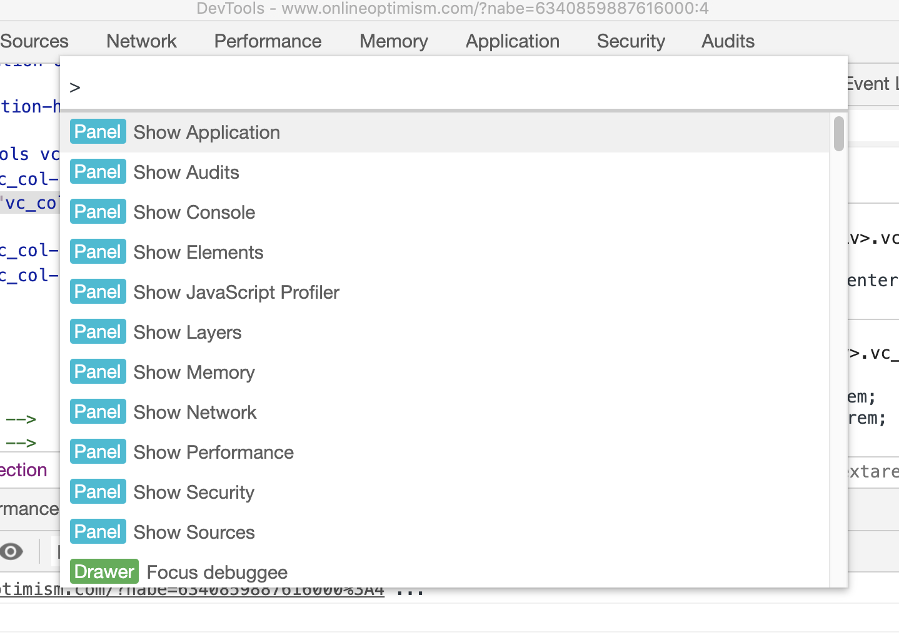
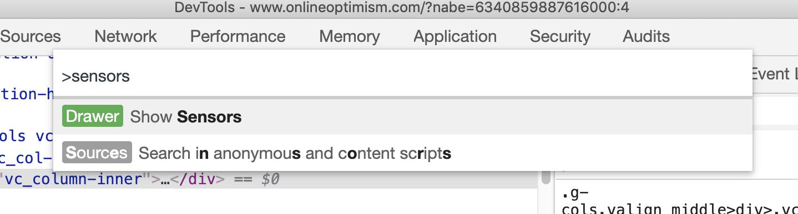
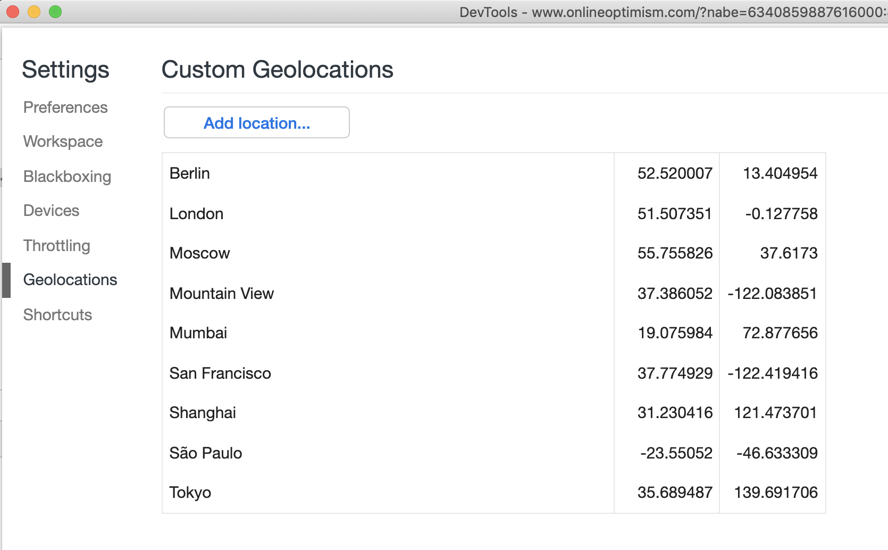
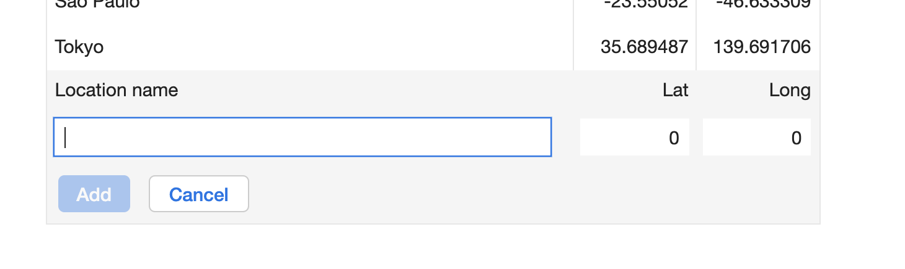
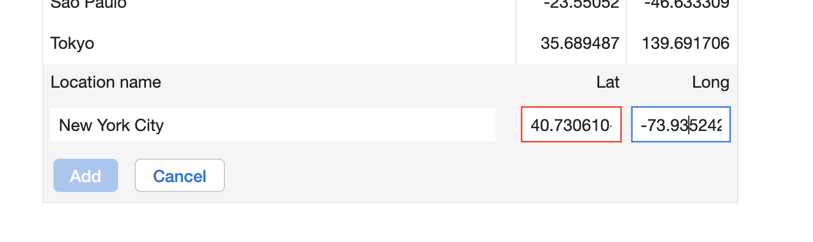
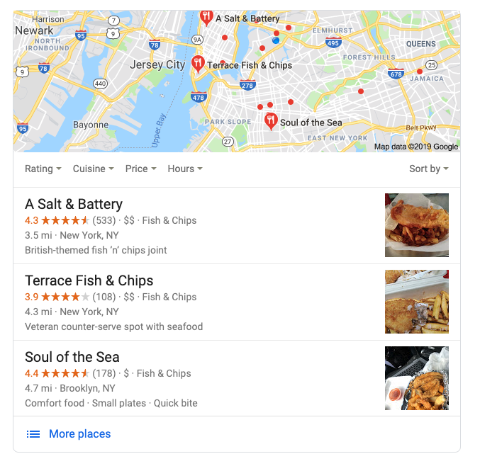

## How To Spoof Geolocation

We recently had an issue where we needed to know what our websites look like in a different location. We wanted to know how one of our sites ranked locally in New York City. We're a growing business, but we don't yet have satellite offices in that location. But with the help of Google Chrome Inspector, we were able to make it appear that we were browsing from New York City.

So how did we do it?

First, fire up your Chrome browser. (Other browsers may have similar capabilities, but these instructions are for Chrome.) Then open **Chrome Inspector**. I typically do this by simply right- clicking on a web page, anywhere, and selecting `Inspect`. The inspector will open up on the page.

 

(*Lagniappe hint:* if the Inspector is stuck in your window taking up most of the room, you can go into the Inspector Settings -- click the three vertical  and change "Dock Side" to pop the Inspector out into its own window. I recommend you do this.)

 

I hope many of you are already familiar with Chrome Inspector, but I'll try not to skip any steps in case this is all new. (And if you find it confusing, please [email me](mailto:david@onlineoptimism.com) email me and I'll try to explain and improve these instructions.)

Now that you have Chrome Inspector open, press `Control+Shift+P`, `Command+Shift+P` if you're on a mac. This Opens the **Command Menu**. 

 

The Command Menu, not surprisingly, contains a lot of commands you can give the Inspector, so it'll do things. In the space at the top of the Command menu, type "Sensors." That filters down to the command you want: Show Sensors. Click that and the Sensors tab will appear in the drawer (i.e., the space at the bottom of your Inspector window).

 

Now for the fun part!

In the Sensors tab, the first thing you'll see is the Sensor for **Geolocation**. That sensor is how Google Chrome knows your location, so you can see the local restaurants and bars and such when you allow Google to know your location. This sensor strongly affects the search results you see in Google searches. So, if your remember the beginning of this blog post, what we wanted to see is how our New York City client came up in searches that originate in New York City. Since we aren't there, here's how we pretend to be.

We're going to override our real geolocation with a fake one. First click the select box that says "No override". What we'd like to do is add one of the existing overrides, as seen in the select box. But wait: The Big Apple's not in there. It's OK, though, we can add it.

 

To add a custom geolocation, click the blue "Manage" button. That'll open a window where you can enter the latitude and longitude of your chosen location and give it a name. 

 

Now where it says "No override", select your new location. I'm using New York City.

 

Once you have added this location, return to the previous screen (click the 'x' in the upper right corner to close this dialog).

Go back to your Chrome window and do an "Empty Cache and Hard Reload" (click and hold the Refresh icon). Now search for something like "fish and chips near me". And how about that? You get fish and chip shops in New York City. You can't go to them, but you can think about them. It's almost like being there, thanks to the Geolocation sensor override in Google Inspector.

 

To summarize: if you need to test location-based searches, or help a friend in another town find fish and chips, the Chrome Inspector gives you a fairly easy way to pretend to be in many places at once. 

